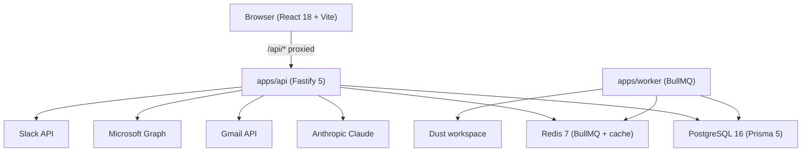

# BidStack 360°

> **Bid & presales CRM with 360° intelligence, Dust agents, and MCP tools.**
> Vendor: Mantu. Stack: React 18 + Fastify 5 + PostgreSQL 16 + BullMQ.

This monorepo ships the standalone build of BidStack 360°. A future migration path to Twenty CRM as an overlay package is preserved verbatim under `packages/twenty-bidstack/`.

---

## Feature matrix

| Module                       | Status   | Notes                                                   |
|------------------------------|----------|---------------------------------------------------------|
| Opportunity / Pipeline       | Shipped  | Kanban + list, stage mutations, bid score               |
| Contacts                     | Shipped  | Detail page, timeline, PII encryption                   |
| Leads                        | Shipped  | BANT qualification, routing rules, conversion tracking  |
| Companies                    | Shipped  | Enrichment, contacts link                               |
| Tasks                        | Shipped  | Assignee, due date, status                              |
| Activities / Timeline        | Shipped  | Polymorphic across all entities                         |
| Notifications                | Shipped  | Web Push (VAPID) + email (Resend) + in-app              |
| Workflow Engine              | Shipped  | Trigger/action builder, drag-and-drop UI                |
| Calendar (two-way)           | Shipped  | Google + Microsoft 365 sync, availability               |
| Public Booking Pages         | Shipped  | `/book/:slug`, no-auth, ICAL export                     |
| SF / HubSpot Import          | Shipped  | CSV/JSON with field mapping, dry-run                    |
| Mobile PWA                   | Shipped  | Offline shell, install prompt                           |
| AI Assistant                 | Shipped  | email-draft, sentiment, meeting-prep, enrich, intel     |
| Analytics + Custom Reports   | Shipped  | 10 chart types, saved reports, dimension/measure picker |
| E-Signature                  | Shipped  | Templates, public signing URL, audit trail              |
| RBAC Matrix                  | Shipped  | 6 roles, resource/action matrix, seeded                 |
| PII Field Encryption         | Shipped  | AES-256-GCM, per-org HKDF keys, opt-in                  |
| Azure SSO / Entra ID         | Shipped  | SAML 2.0, JIT provisioning                              |
| Gmail Integration            | Shipped  | OAuth 2.0, send, read, tracking pixel                   |
| Outlook / MS Graph Mail      | Shipped  | OAuth 2.0, send, Graph webhook subscription             |
| Slack Integration            | Shipped  | OAuth, Events API, Block Kit, DMs                       |
| Zapier Integration           | Shipped  | Trigger webhooks, action handlers                       |
| Custom Fields                | Shipped  | Per-org, per-entity EAV schema                          |
| Bid Score / No-Bid           | Shipped  | Weighted scoring, MemOS policy calibration              |
| RFP / Proposal Factory       | Shipped  | Sections, AI draft, status workflow                     |
| MCP Server (Dust tools)      | Shipped  | 6 tools: read/write opportunities, contacts, tasks      |
| Invoicing                    | Shipped  | Invoice + lines, multi-currency, PDF export             |
| Audit Log                    | Shipped  | Immutable log for all mutations                         |
| Search                       | Shipped  | Cross-entity full-text search                           |

---

## Quick start

```bash
# Prerequisites: Node 24, pnpm 10, Docker (for Postgres + Redis)

# 1. Install
pnpm install

# 2. Spin up Postgres + Redis
docker compose up -d

# 3. Configure environment
cp .env.example .env
# Edit .env: fill in DATABASE_URL, REDIS_URL, CLERK_SECRET_KEY at minimum.
# Leave CLERK_* blank for local dev — stub auth mints a single-user session.

# 4. Migrate database + seed fixtures
pnpm db:migrate
pnpm db:seed

# 5. Start all services
pnpm dev
```

Open:
- Web: http://localhost:5173
- API: http://localhost:4000
- MCP: http://localhost:4001
- API health: http://localhost:4000/health

---

## Architecture overview



Full diagram and module documentation: [`docs/ARCHITECTURE.md`](./docs/ARCHITECTURE.md)

---

## Scripts

| Command                              | What it does                                    |
|--------------------------------------|-------------------------------------------------|
| `pnpm dev`                           | Run web + api + worker + mcp-server in parallel |
| `pnpm dev:web`                       | Web only                                        |
| `pnpm dev:api`                       | API only                                        |
| `pnpm db:migrate`                    | Apply Prisma migrations                         |
| `pnpm db:seed`                       | Seed from prototype fixtures                    |
| `pnpm db:reset`                      | **Destructive** — drop + recreate               |
| `pnpm typecheck`                     | All packages                                    |
| `pnpm lint`                          | All packages                                    |
| `pnpm test`                          | Vitest across all packages                      |
| `pnpm e2e`                           | Playwright on the web app                       |
| `pnpm build`                         | Production build of every package               |
| `tsx scripts/encrypt-existing-pii.ts`| One-shot PII encryption migration               |

---

## Screenshots

> _Screenshots will be added when the production environment is provisioned._

---

## Documentation

| File                                            | Purpose                                         |
|-------------------------------------------------|-------------------------------------------------|
| [`SPEC.md`](./SPEC.md)                          | Canonical product spec + feature list           |
| [`CLAUDE.md`](./CLAUDE.md)                      | 14 conduct rules + architecture conventions     |
| [`PROGRESS.md`](./PROGRESS.md)                  | Sprint log + quality scores                     |
| [`CHANGELOG.md`](./CHANGELOG.md)                | Feature changelog (Keep a Changelog format)     |
| [`docs/ARCHITECTURE.md`](./docs/ARCHITECTURE.md)| Architecture overview + module boundaries       |
| [`docs/RUNBOOK.md`](./docs/RUNBOOK.md)          | Operations: deploy, rollback, rotate keys       |
| [`docs/security/pii-field-encryption.md`](./docs/security/pii-field-encryption.md) | PII encryption runbook |
| [`docs/DUST.md`](./docs/DUST.md)                | Dust integration patterns                       |
| [`docs/MCP.md`](./docs/MCP.md)                  | MCP server design                               |
| [`load-tests/README.md`](./load-tests/README.md)| k6 load test instructions                       |

---

## License

Proprietary — © Mantu, all rights reserved.
