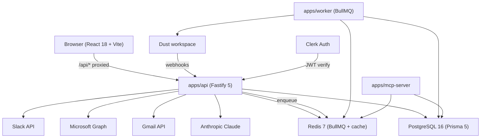

# Architecture — BidStack 360°

> Last reviewed: 2026-05-24. Authoritative complement to `SPEC.md`.
> Waves 3–5 additions documented below the topology section.

## Topology

```
                         ┌──────────────────────────────────────┐
                         │              Browser                 │
                         │   apps/web (React 18 + Vite)         │
                         └──────────────────────────────────────┘
                                       │   /api/*  (proxied)
                                       ▼
┌──────────────────────────────────────────────────────────────────┐
│                         apps/api (Fastify 5)                     │
│  - Zod validation                                                │
│  - Clerk stub auth (dev) / Clerk JWT (prod)                      │
│  - Org-scoped Prisma queries                                     │
│  - /webhooks/dust receiver (HMAC + dedup)                        │
└──────────────────────────────────────────────────────────────────┘
            │                                       │
            ▼                                       ▼
   ┌──────────────────┐                  ┌──────────────────────┐
   │  Postgres 16     │                  │   Redis 7 (BullMQ)   │
   │  (via Prisma 5)  │                  │   - dust-poll queue  │
   └──────────────────┘                  │   - dust-webhook q.  │
            ▲                            └──────────────────────┘
            │                                       ▲
            │                                       │
   ┌──────────────────┐                  ┌──────────────────────┐
   │  apps/mcp-server │                  │  apps/worker         │
   │  6 tools per     │                  │  Pulls Dust deltas,  │
   │  mcp.tools.md    │                  │  drains sync_events  │
   └──────────────────┘                  └──────────────────────┘
            ▲                                       │
            │ /mcp (JSON-RPC 2.0 + Bearer)         │
            │                                       │
   ┌──────────────────────────────────────────────────────────────┐
   │              Dust workspace (mantu-presales)                 │
   │  - calls our MCP tools to read/write CRM data                │
   │  - posts webhooks to /webhooks/dust                          │
   └──────────────────────────────────────────────────────────────┘
```

## Tenancy model

- Every business table has `org_id` (per `handoff/db.schema.sql`).
- The auth plugin (`apps/api/src/plugins/auth.ts`) injects `req.auth.orgId` on every request.
- Every Prisma query MUST include `where: { orgId }`. The `code-quality` rule in `.claude/rules/` is the enforcement floor; reviewer agent flags any missing scope.
- The MCP server resolves `orgId` from the API key (`apps/mcp-server/src/auth.ts`), so an MCP client can only see/mutate the org that minted the key.

## Module boundaries

| Module                 | Talks to                                                                       | Doesn't talk to                                     |
| ---------------------- | ------------------------------------------------------------------------------ | --------------------------------------------------- |
| `apps/web`             | `/api/*` only                                                                  | DB, Redis, MCP, Dust API                            |
| `apps/api`             | DB, Redis (via worker queue), Dust client (rare — most reads happen in worker) | Browser DOM                                         |
| `apps/worker`          | DB, Redis, Dust API                                                            | API HTTP                                            |
| `apps/mcp-server`      | DB, Redis (rate limit)                                                         | Dust API directly (it serves Dust, not the reverse) |
| `packages/db`          | Postgres                                                                       | nothing else                                        |
| `packages/dust-client` | Dust HTTP API                                                                  | DB                                                  |
| `packages/shared`      | nothing — pure types/schemas                                                   | nothing                                             |

## Data flow — the Dust loop

Three patterns, all documented in `handoff/dust.integration.md`:

1. **Outbound pull (every 5 min):** `apps/worker` → `dust-client.listDocuments()` → upsert into `opportunities`/`documents`. Records a `sync_event` row with `source='dust.poll'`.
2. **Outbound push (on opportunity write):** API mutation → enqueue BullMQ job → `dust-client.upsertDocument()`. Records `sync_event` with `source='dust.push'`.
3. **Inbound webhook:** Dust → `POST /webhooks/dust` → HMAC verify → Redis dedup → write `sync_event` with `source='dust.webhook'` and `status='received'` → ack <50ms. Worker drains and processes.

## MCP exchange

Per `handoff/mcp.tools.md`. The 6 tools are registered in `apps/mcp-server/src/tools/index.ts`. Each tool:

- Validates input with Zod
- Scopes every Prisma call by `ctx.orgId` (extracted from the per-key auth context)
- Writes `audit_log` for every mutation
- Returns structured JSON

Rate limit: 60/min per API key (default `@fastify/rate-limit`); 600/hour enforced via spec but not yet implemented as a separate sliding window — will be added when production load demands it.

## Theming + dark mode

- All colors live as CSS variables in `apps/web/src/index.css`.
- `data-theme="light"` (default) and `data-theme="dark"` switch the variables.
- The Tailwind 4 `@theme` block bridges the variables into utility classes (`text-fg-primary`, `bg-surface-card`, etc.) so authors can use either form.
- Theme toggle persists to `localStorage('bidstack-theme')` and is applied **before paint** by the inline script in `index.html` to prevent FOUC.
- Initial theme defaults to `prefers-color-scheme` if no preference is saved.

## Performance budgets

Per `SPEC.md` §2.3:

- LCP < 2.5s (mobile + desktop)
- INP < 200ms
- CLS < 0.1
- Tested in `pnpm e2e` with Playwright Lighthouse audits before each release.

## Security boundaries

- Inbound: every endpoint goes through `authPlugin`; only `/health` and `/webhooks/dust` opt out (the latter has its own HMAC verification).
- Outbound: every external HTTP call (Dust, Anthropic) lives in a typed wrapper package (`@bidstack/dust-client`) so retry/backoff/timeout policies are uniform.
- Secrets: `.env.example` documents every needed key; real `.env` is gitignored; `scan-secrets.sh` hook blocks any accidental commit of common token patterns (Anthropic, Stripe, AWS, GitHub, JWT, private keys).
- CSP: `@fastify/helmet` is enabled; CSP is currently disabled in dev to allow Vite HMR; production config tightens it.

---

## Wave 3 — Notifications, Workflow Engine, Calendar & Booking

### Notification Engine

- **Push notifications**: Web Push (VAPID) via `apps/worker`. Subscription stored per user in `push_subscriptions` table.
- **Email notifications**: Resend SDK via `apps/api/src/services/notification.service.ts`.
- **In-app**: BullMQ `notification` queue drains to `notifications` table; frontend polls `/api/v1/notifications`.

### Workflow Engine + Builder

- `workflows` table stores trigger kind + action sequence as JSON (`WorkflowTriggerKind`, `WorkflowActionKind` Prisma enums).
- `apps/api/src/services/workflow.service.ts` evaluates trigger conditions on model mutations.
- Frontend: `WorkflowBuilderPage` (drag-and-drop trigger/action nodes via `@xyflow/react`).

### Calendar Two-Way + Booking

- `CalendarProvider` model (`google` | `microsoft`) stores OAuth tokens (encrypted via `token-cipher.ts`).
- Worker syncs external calendars every 5 min (`apps/worker/src/queues/calendar-sync.ts`).
- Public booking pages: `/book/:slug` → `booking_pages` table. Availability algorithm respects connected calendar events.
- Microsoft 365: Graph API subscription webhook at `POST /api/v1/integrations/microsoft/webhook/notifications`.

### SF/HubSpot Migration Import

- `/api/v1/migration/*` routes accept CSV/JSON export files.
- Field mapping stored per org in `migration_field_maps` (JSON).
- Dry-run mode returns preview without writing.

### Mobile PWA

- `apps/web/public/manifest.webmanifest` + service worker (`sw.js`).
- Offline cache: static shell + last-visited list pages.
- Install prompt handled by `usePwaInstall` hook.

---

## Wave 4 — AI Assistant, Analytics, E-Signature, RBAC, Integration Hub

### AI Assistant

- Six AI actions: `email-draft`, `sentiment`, `meeting-prep`, `enrich`, `account-intel`, `bid-defense`.
- Route: `POST /api/v1/ai-assistant/:action`.
- Backed by Anthropic Claude via `packages/shared/src/services/ai-assistant.service.ts`.
- Token budget enforced per call; streaming SSE for long responses.

### Analytics + Custom Reports

- `reports` table stores query definition as JSON (dimensions, measures, filters, time range).
- `GET /api/v1/reports/:id/data` executes parameterised Prisma query and returns rows.
- Frontend: `ReportsPage` → `ChartContainer` with 10 chart types (KpiCard, BarChart, LineChart, PieChart, …).

### E-Signature

- `signature_requests` + `signature_envelopes` tables.
- Public signing URL: `/sign/:token` (no auth required, token-scoped).
- Audit trail: every signature event logged in `audit_logs`.

### RBAC Matrix

- 6 roles: `admin`, `sales_manager`, `account_executive`, `sdr`, `marketing`, `viewer`.
- `RBAC_MATRIX` constant in `packages/shared/src/rbac/matrix.ts` maps role → resource → `[create, read, update, delete]`.
- `rbacPlugin` in `apps/api/src/plugins/rbac.ts` enforces per-route via `{ config: { requiredPermission: ... } }`.
- Seeded via `packages/db/src/seed.ts`.

### PII Field Encryption (Wave 5)

- AES-256-GCM encryption for `Contact.email/phone`, `Lead.email/phone`, and `KamConsultant.email`.
- Per-org key derivation: `HKDF-SHA256(masterKey, orgId)`.
- Envelope: `enc:v1:<iv>:<tag>:<ciphertext>`.
- Searchable hash: `emailHash` column (trim/lowercase email, HMAC-SHA256, keyed).
- Prisma `$use` middleware auto-encrypts on write, rewrites supported email equality filters to `emailHash`, and auto-decrypts on read.
- Opt-in: `PII_FIELD_ENCRYPTION=true`. Default off for backward compatibility.
- `User.email` remains outside field encryption until a generated `User.emailHash` migration exists.
- Runbook: `docs/security/pii-field-encryption.md`.

### Azure SSO / Microsoft Entra

- SAML 2.0 SSO via `passport-saml` + Microsoft Entra ID.
- Routes: `GET /api/v1/auth/saml/login` → ACS `POST /api/v1/auth/saml/acs`.
- JIT provisioning: first login creates `User` row linked to `clerkUser`.
- See `docs/MICROSOFT_SSO.md` and `docs/MICROSOFT_ENTRA_INTEGRATION.md`.

### Gmail / Outlook Integration Hub

- Gmail: OAuth 2.0 via `GET /api/v1/integrations/gmail/oauth/initiate` → callback.
- Outlook: Microsoft Graph OAuth via `GET /api/v1/integrations/microsoft/mail/oauth/initiate`.
- Email sending: `POST /api/v1/integrations/email/send` (provider-agnostic; routes to Gmail or Outlook).
- Tracking pixel: `GET /api/v1/integrations/email/track/:pixelId/open.gif`.
- Token storage: `IntegrationToken` model with `token-cipher.ts` AES-256-GCM encryption.

### Slack Integration

- OAuth app connection: `GET /api/v1/integrations/slack/oauth/initiate`.
- Events API: `POST /api/v1/integrations/slack/events` (URL verification + event dispatch).
- `SlackChannel` model stores workspace metadata.
- Block Kit message builder in `apps/api/src/services/slack.service.ts`.

### Zapier Integration

- `ZapierApp` / `ZapierTrigger` / `ZapierAction` models.
- Webhook trigger: `POST /webhooks/zapier/:orgId/:triggerId`.

### Custom Fields

- `custom_field_definitions` (per org, per entity type) + `custom_field_values` (EAV).
- `GET/POST /api/v1/custom-fields/:entityType` routes.
- Frontend renders dynamically in detail pages (Contact, Lead, Opportunity).

### Activity Timeline

- `activities` table: polymorphic `entityType` + `entityId`.
- Types: `note`, `call`, `email`, `meeting`, `task_completed`, `stage_change`, `file_upload`.
- `GET /api/v1/:entityType/:id/activities` returns chronological timeline.

---

## Component diagram (Wave 5)


