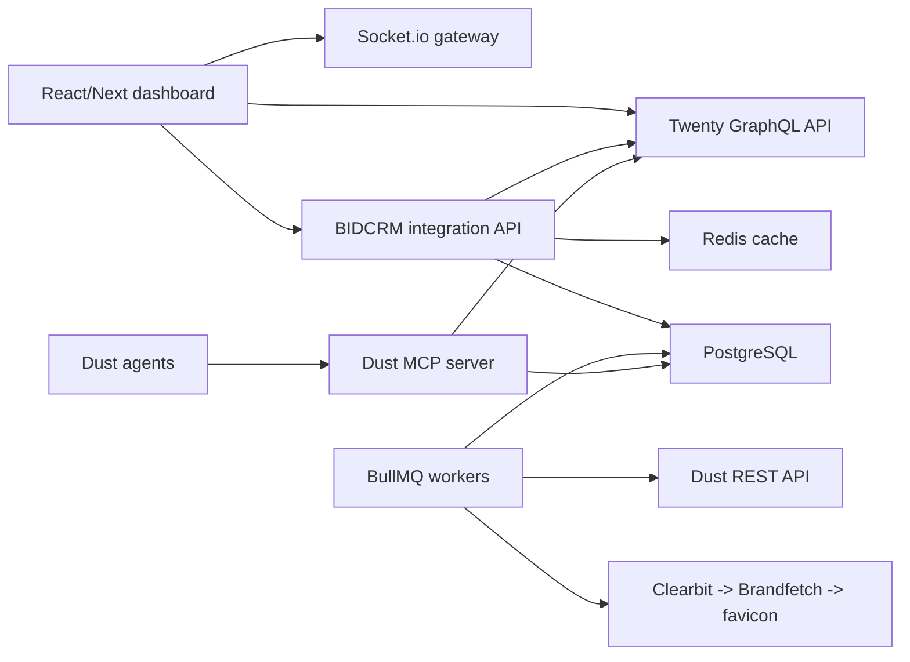

# Twenty + Dust Integration Architecture

Status: implementation baseline, 2026-05-11.

## Direction

`D:\BIDCRM` is the product frontend and integration workspace for a Twenty-derived CRM. The adapted backend source of truth is `mysticalsin/twenty`, which preserves Twenty's core object model and GraphQL API:

- Companies
- People
- Deals
- Activities

BidStack/Stack360 extensions must sit beside that model instead of replacing it. Custom enrichment tables should reference Twenty object IDs and keep AI/Dust state out of the canonical CRM records.

## Runtime Shape

## Data Ownership

Twenty owns:

- Company identity, domains, people, deals, activities
- GraphQL mutations and permissions
- Workspace/object-level tenancy

BIDCRM owns:

- `company_enrichments`: logo source/cache metadata, firmographics, enrichment status
- `ai_insights`: insight kind, summary, confidence, source attribution, related company/deal
- `dust_runs`: Dust app run IDs, inputs, outputs, status, token/use metadata
- `dashboard_widgets`: per-user draggable widget layout
- `sync_events`: webhook/poll/realtime audit trail

## Shared Contract

The first code-level contract is in `packages/shared/src/schemas/crm.ts`. It intentionally mirrors Twenty primitives with integration-friendly names:

- `CrmCompany`
- `CrmPerson`
- `CrmDeal`
- `CrmActivity`
- `AiInsight`
- `DashboardWidget`
- `CrmDashboardSnapshot`
- `DustCrmToolName`

Every frontend widget, GraphQL adapter, worker processor, and MCP tool should validate against these schemas at boundaries.

## Dust Modes

REST mode:

- Query Dust knowledge sources.
- Run Dust Apps for enrichment and forecast generation.
- Persist normalized outputs in `ai_insights` and `dust_runs`.

MCP mode:

- Expose live CRM tools to Dust agents:
  - `crm_search_companies`
  - `crm_create_deal`
  - `crm_update_deal`
  - `crm_enrich_company`
  - `crm_list_activities`
  - `crm_create_activity`
  - `crm_generate_insights`
- Tools must call Twenty GraphQL for canonical CRM writes.
- Tools may write BIDCRM extension tables for AI/Dust metadata.

## Logo Pipeline

1. Normalize company domain.
2. Try Clearbit Logo API.
3. Fall back to Brandfetch.
4. Fall back to `https://<domain>/favicon.ico`.
5. Store URL, provider, and cache timestamp in `company_enrichments`.
6. UI displays cached logo first, then initials avatar.

## Frontend Target

The dashboard target is the Stack360 account cockpit from `C:\Users\Tony\Downloads\image (1).png`, not the old standalone bid portfolio. The first-class widgets are:

- Pipeline Funnel
- Revenue Forecast
- Company Grid
- AI Insights Feed
- Activity Timeline

The shell must keep:

- Global Cmd+K
- Dark/light mode
- Inline editing
- Bulk actions
- Socket.io updates
- Draggable widgets

## Implementation Order

1. Make tests and E2E deterministic.
2. Add the shared CRM/Dust schemas.
3. Add a Twenty GraphQL adapter package or app module.
4. Add extension Prisma tables and migrations.
5. Replace standalone REST reads in the dashboard with adapter-backed CRM snapshots.
6. Add BullMQ logo/enrichment jobs.
7. Add Dust REST client and MCP tool names from the shared contract.
8. Add Socket.io update events after writes and job completion.
